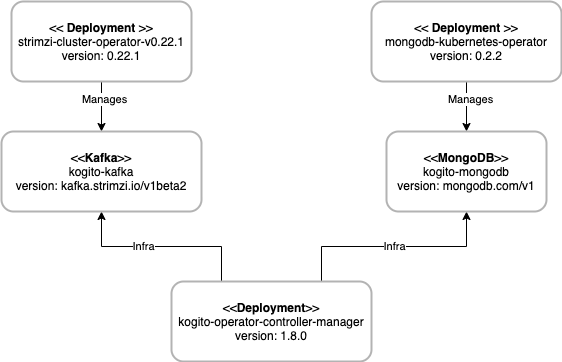

# Table of Contents
* [Deploying the Kogito infrastructure](#deploying-the-kogito-infrastructure)
  * [Prerequisites](#prerequisites)
  * [Install the MongoDB operator](#install-the-mongodb-operator)
  * [Deploy the MongoDB instance](#deploy-the-mongodb-instance)  
  * [Install MongoDB infra in Kogito operator](#install-mongodb-infra-in-kogito-operator)
  * [Install the Kafka operator](#install-the-kafka-operator)
  * [Deploy the Kafka instance](#deploy-the-kafka-instance)  
  * [Install Kafka infra in Kogito operator](#install-kafka-infra-in-kogito-operator)
* [Deploying the Kogito App](#deploying-the-kogito-app)
* [Troubleshooting Tips](#troubleshooting-tips)  
  * [MondoDB Collections](#mondodb-collections)  
* [References](#references)
    
# Deploying the Kogito infrastructure
**Following steps have been validated against Kogito version 1.8.0.Final**

The kogito infrastructure is made of:
* MongoDB operator
  * Manages the `kogito-mongodb` instance
* Kakfa/Strinzi operator
  * Manages the `kogito-kafka` instance
* Kogito operator, with infra:
  * kogito-mongodb-infra
  * kogito-kafka-infra

The following diagram illustrates the infrastructural components of the testing environment:



## Prerequisites
* Have [oc](https://docs.openshift.com/container-platform/4.7/cli_reference/openshift_cli/getting-started-cli.html)
and [kogito](https://docs.jboss.org/kogito/release/latest/html_single/#con-kogito-on-ocp_kogito-deploying-on-openshift)
CLI tools
* Login to OCP with `oc login` to the target OCP platform [TDB] 
* Create a new project `PROJECT_NAME` with `oc new-project` or `kogito new-project`
* Install the Kogito operator from the OCP console in the `PROJECT_NAME` namespace.

## Install the MongoDB operator
The Kogito Operator is validated against [MongoDB Community Kubernetes Operator 0.2.2](https://github.com/kiegroup/kogito-operator#kogito-operator-tested-integrations), 
which is installed from the [MongoDB Community Kubernetes Operator](https://github.com/mongodb/mongodb-kubernetes-operator) 
repository:
```shell
git clone git@github.com:mongodb/mongodb-kubernetes-operator.git
cd mongodb-kubernetes-operator
git checkout v0.2.2
```

To properly deploy on OpenShift, we have to add the following property to the file `deploy/operator.yaml`,
under the `spec.template.spec.env` section:
```yaml
            - name: MANAGED_SECURITY_CONTEXT
              value: 'true'
```

Finally, we can install the `CustomResourceDefinition` of kind `MongoDB`  and all the resources of the operator:
```sh
oc create -f deploy/crds/mongodb.com_mongodb_crd.yaml
oc create -f deploy/
```

To fix the issue [Unable to deploy Mongodb Replica Set on Openshift](https://github.com/mongodb/mongodb-kubernetes-operator/issues/212#issuecomment-704744307),
we have to execute the following command:
```sh
oc adm policy add-scc-to-user anyuid system:serviceaccount:PROJECT_NAME:mongodb-kubernetes-operator
```
## Deploy the MongoDB instance
We create the MongoDB instance using the given [kogito-mongodb.yml](./kogito-mongodb.yml) YAML configuration:
```shell
oc create -f kogito-mongodb.yml
```
This creates one instance `kogito-mongodb` of type `MongoDB` named in the OCP cluster.
In case of successful deployment, you can see 3 Pods named `kogito-mongodb-[0-2]` in `Running` state.
In case of issues, start troubleshooting from the log of the Pod named `mongodb-kubernetes-operator-NNN`.

## Install MongoDB infra in Kogito operator
Once the MongoDB instance has been created, we can set up the Kogito infrastructure with:
```shell
kogito install infra kogito-mongodb-infra --kind MongoDB \
--apiVersion mongodb.com/v1 --resource-name kogito-mongodb \
--property username=developer --property database=kogito_dataindex
```
If the creation is successfull, you can see the `kogito-mongodb` instance in the `Kogito Infra` tab of the Kogito operator,
with Status equal to `Condition: Configured`

## Install the Kafka operator
We install the Kafka operator from the OCP console: select the operator `Strimzi 0.22.1 provided by Strimzi` and install it
in the project namespace.

## Deploy the Kafka instance
Once the Kafka operator is installed, we create one instance `kogito-kafla` of the managed type `Kafka`, from the given [kogito-kafka.yml](./kogito-kafka.yml)
YAML configuration:
```shell
oc create -f kogito-benchmarking/kogito-kafka.yml --namespace PROJECT_NAME
```
In case of successful deployment, you can see 2 Pods named `kogito-kafka-[0-1]` and 2 Pods `kogito-kafka-zookeeper-[0-1]`
in `Running` state.

## Install Kafka infra in Kogito operator
Once the Kafka instance has been created, we can set up the Kogito infrastructure with:
```shell
kogito install infra kogito-kafka-infra --kind Kafka --apiVersion kafka.strimzi.io/v1beta2 --resource-name kogito-kafka
```

** WIP***
## Install Data-Index infra in Kogito operator
```shell
kogito install data-index --image kogito-data-index-mongodb --infra kogito-mongodb-infra --infra kogito-kafka-infra
```

# Deploying the Kogito App
Starting from the `process-mongodb-persistence-quarkus` repository folder, build and deploy the application leveraging on
the s2i feature of OCP:
```shell
git clone git@github.com:kiegroup/kogito-examples.git
cd kogito-examples
git checkout 1.8.0.Final
cd process-quarkus-example

kogito deploy-service process-quarkus-example . --infra kogito-mongodb-infra --infra kogito-kafka-infra
```
Once the builds succeeds, you should see one Pod named `process-quarkus-example-NNN` in `Running` state, and one Route named 
`process-quarkus-example` to expose the REST APIs outside the OCP cluster.
You can access the Swagger API by adding `/q/swagger-ui` to the route location, and test them out.

# Troubleshooting Tips
## MondoDB Collections
Enter the Terminal tab of one of the running `kogito-mongodb-NN` pods, and select the `mongod` container.
Then run the following commands to verify the content of the database:
```shell
mongo -u developer
show dbs
use kogito_dataindex
show collections
db.demo.orders.count()
```

# References
* [Kogito docs](https://docs.jboss.org/kogito/release/latest/html_single)
* [QE test code in kogito-operator repository](https://github.com/kiegroup/kogito-operator/tree/master/test)
  * [Travel Agency example](https://github.com/kiegroup/kogito-operator/blob/master/test/features/deploy_travel_agency.feature)
* [Marian Macik](https://rover.redhat.com/people/profile/mmacik): Kogito QE
* [Ricardo Zanini Fernandes](https://rover.redhat.com/people/profile/ricferna): Kogito SE
